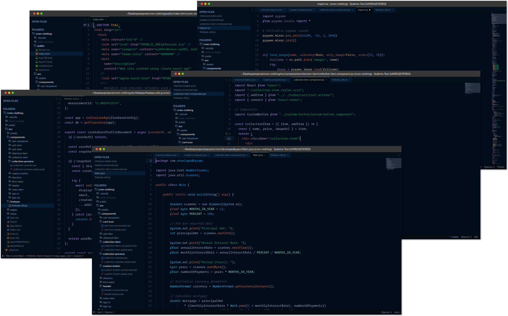
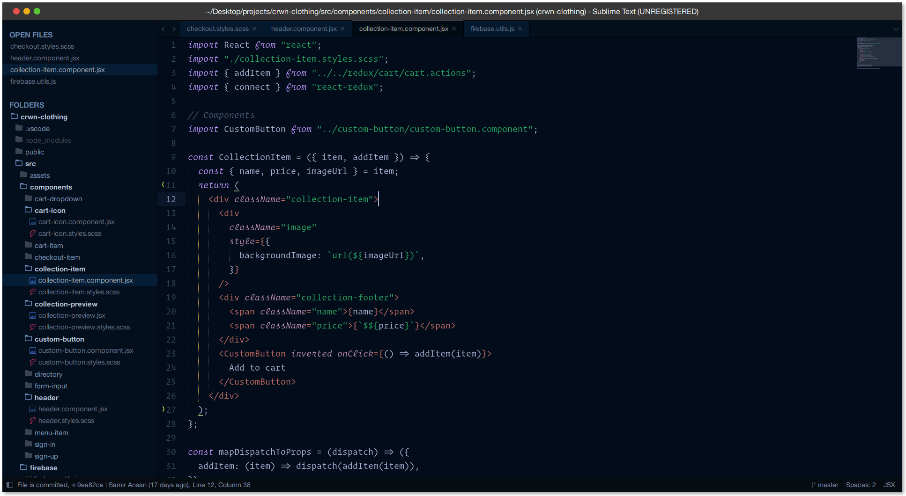
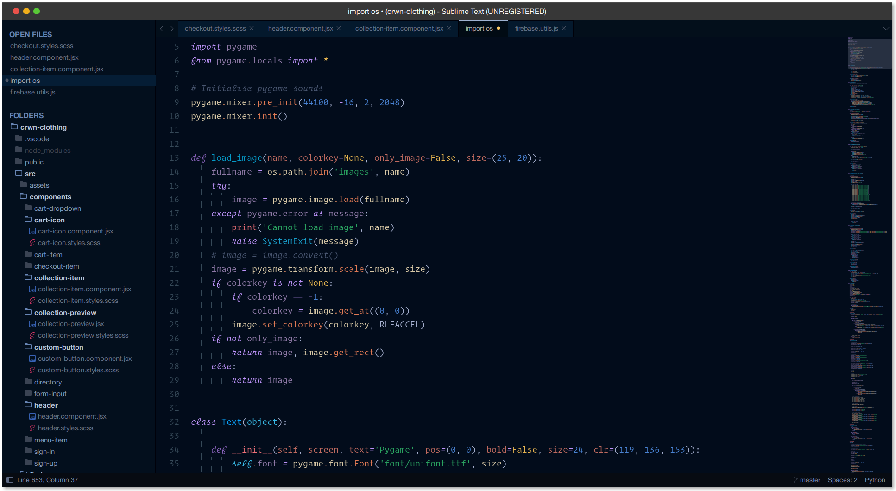

`Mooon Light` is a simple theme with vibrant colors build on pre existing theme which I really like called `ayu`.

### File Icons

`Mooon Light` supports customization via [A File Icon](https://github.com/ihodev/a-file-icon) package. Please install it and restart Sublime for better experience.

### Custom UI fonts

If you want to use your favourite font in the
user interface of the theme, just follow through these simple steps:


1. Pull up command pallete via <kbd>cmd/ctrl</kbd> + <kbd>shift</kbd> + <kbd>p</kbd>
2. Type in `Browse packages`
3. Navigate to the `/User` folder
4. Create a file named `mooon-light.sublime-theme`
5. Open that file in Sublime
6. Copy and paste following content:
   ```json
   [
      {
         "class": "sidebar_label",
         "font.size": 16,
         "font.face": "Operator Mono Lig"
      },
      {
         "class": "sidebar_heading",
         "font.size": 16,
         "font.face": "Operator Mono Lig"
      },
      {
         "class": "tab_label",
         "font.size": 14,
         "font.face": "Operator Mono Lig"
      },
      {
         "class": "label_control",
         "font.size": 14,
         "font.face": "Operator Mono Lig"
      },
      {
         "class": "quick_panel_label",
         "font.size": 14,
         "font.face": "Operator Mono Lig"
      },
      {
         "class": "quick_panel_path_label",
         "font.size": 14,
         "font.face": "Operator Mono Lig"
      }
   ]
   ```
7. Replace `Operator Mono Lig` with the font of your choice
8. Font size I use is in the JSON above, but you can set your own
9. Save and enjoy :)

### Screenshots


---



---



### Recommended Settings

    If you want your theme to look as close as in the screenshots, copy these in your settings

```js
"ui_native_titlebar":       true, // use native titlebars on macOs
"ui_separator":             true, // separators between panels
```

---

### Installation

###### Recommended

You can install `Mooon Light` via [Package Control](https://packagecontrol.io/).

1. Press <kbd>cmd/ctrl</kbd> + <kbd>shift</kbd> + <kbd>p</kbd> to open the command palette.
2. Type `install package` and press enter. Then search for `Mooon Light`

###### Manual

1. Download the [latest release](https://github.com/developedby-sam/mooon-light/releases), extract and rename the directory to `Mooon Light Theme`.
2. Move the directory inside your sublime `/Packages` directory. _(Preferences > Browse packages...)_

---

### Activation

###### With Skins package

[Skins](https://packagecontrol.io/packages/Skins) provides a simple and efficient way to change themes, save your own presets and quickly try out new looks. Activation is as simple as opening up the command palette, running `Select Skin` and choosing `mooon-light` from the list.

###### Via Preferences

Add these lines to your user settings _Preferences > Setting - User_:

```js
"theme": "mooon-light.sublime-theme",
"color_scheme": "Packages/Mooon Light Theme/mooon-light.sublime-color-scheme",
```

<div align="right"><sup>
  trying to make your day easy by<a href="https://github.com/developedby-sam">@developedby-sam</a>
</sup></div>
