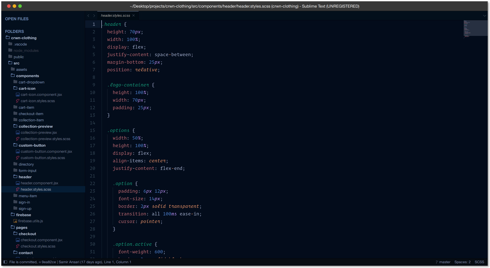
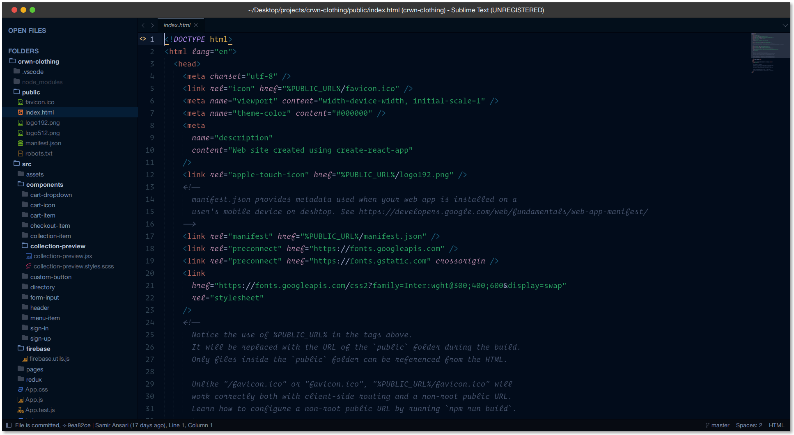
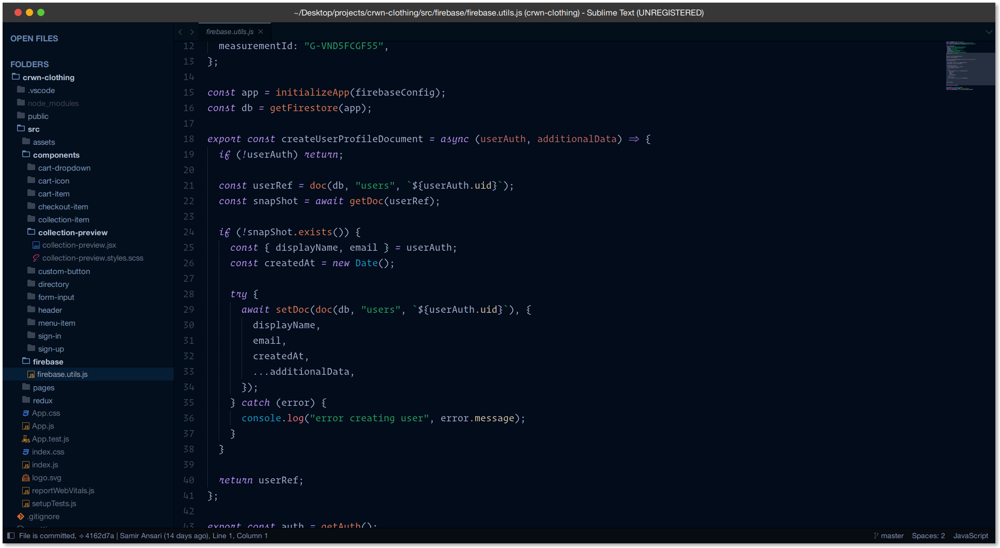
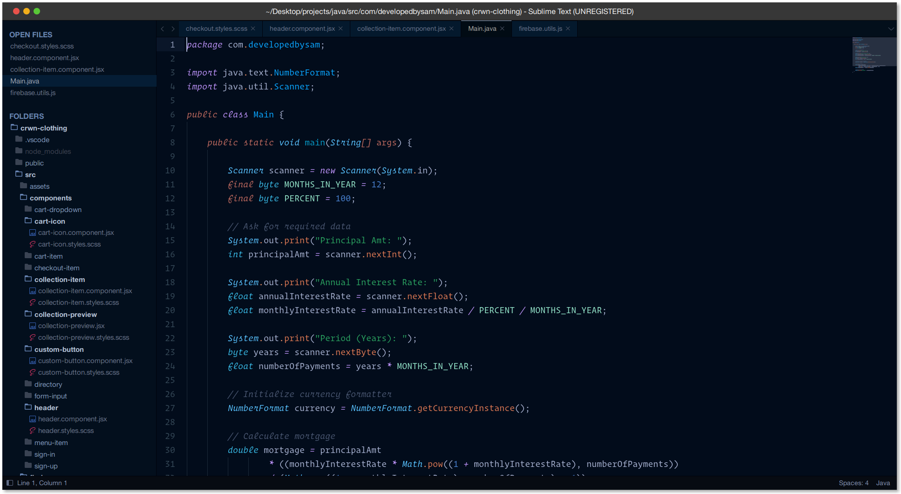

`Mooon Light` is a simple theme with vibrant colors build to reduce strain on your eyes 😃.

### File Icons

`Mooon Light` supports customization via [A File Icon](https://github.com/ihodev/a-file-icon) package. Please install it and restart Sublime for better experience.

### Custom UI fonts

If you want to use your favourite font in the
user interface of the theme, just follow through these simple steps:



1. Pull up command pallete via <kbd>cmd/ctrl</kbd> + <kbd>shift</kbd> + <kbd>p</kbd>.
2. Type in `Browse packages`.
3. Navigate to the `/User` folder.
4. Create a file named `mooon-light.sublime-theme`.
5. Open that file in Sublime.
6. Copy and paste following content:
   ```json
   [
     {
       "class": "sidebar_label",
       "font.size": 14,
       "font.face": "Operator Mono Lig"
     },
     {
       "class": "sidebar_heading",
       "font.size": 14,
       "font.face": "Operator Mono Lig"
     },
     {
       "class": "tab_label",
       "font.size": 12,
       "font.face": "Operator Mono Lig"
     },
     {
       "class": "label_control",
       "font.size": 12,
       "font.face": "Operator Mono Lig"
     },
     {
       "class": "quick_panel_label",
       "font.size": 12,
       "font.face": "Operator Mono Lig"
     },
     {
       "class": "quick_panel_path_label",
       "font.size": 12,
       "font.face": "Operator Mono Lig"
     }
   ]
   ```
7. Replace `Operator Mono Lig` with the font of your choice.
8. Adjust font size as you want.
9. Save and enjoy :)

### If you want to use the same font as mine!! Checkout my github repo below:

**_Please only use this font (Operator Mono) for personal use, the font itself is available free for download online as well for personal use but for commercial or sale, it must be purchased_**

[OperatorMonoLig](https://github.com/developedby-sam/OperatorMonoLig)

### Screenshots



---


---



---



---


### Recommended Settings

    If you want your theme to look as close as in the screenshots, copy these in your settings

```js
"ui_native_titlebar":               true/false, // use native titlebars on macOs
"ui_separator":                     true/false, // separators between panels
"themed_title_bar":                 true/false, // customized title bar for windows
"sidebar_large":                    true/false, // for bigger sidebar
"sidebar_small":                    true/false, // for smaller sidebar
 "sidebar_font_large":              true/false, // bigger sidebar font
 "sidebar_font_small":              true/false, // smaller sidebar font
 "bold_folder_labels":              true/false, // bold folder labels
 "tabs_large":                      true/false, // bigger tabs
 "tabs_small":                      true/false, // smaller tabs
 "enable_tab_scrolling":            true/false, // enable or disable tab scrolling
 "highlight_modified_tabs":         true/false, // highliht modified tabs
 "always_show_minimap_viewport":    true/false, // always show minimap viewport
```

---

### Installation

###### Recommended

You can install `Mooon Light` via [Package Control](https://packagecontrol.io/).

1. Press <kbd>cmd/ctrl</kbd> + <kbd>shift</kbd> + <kbd>p</kbd> to open the command palette.
2. Type `install package` and press enter. Then search for `Mooon Light`

###### Manual

1. Download the [latest release](https://github.com/developedby-sam/mooon-light/releases), extract and rename the directory to `Mooon Light Theme`.
2. Move the directory inside your sublime `/Packages` directory. _(Preferences > Browse packages...)_

---

### Activation

###### Via Command Palette

1. Press <kbd>cmd/ctrl</kbd> + <kbd>shift</kbd> + <kbd>p</kbd> to open the command palette.
2. Type `select color scheme` and press enter. Then search for `mooon-light.sublime-color-scheme` or `mooon-light-highcontrast.sublime-color-scheme` (which ever you prefer) and press enter.
3. Again in command palette Type `select theme` and press enter. Then search for `mooon-light.sublime-theme` and press enter.

###### Via Skins

[Skins](https://packagecontrol.io/packages/Skins) provides a simple and efficient way to change themes, save your own presets and quickly try out new looks. Activation is as simple as opening up the command palette, running `Select Skin` and choosing `mooon-light` from the list.

###### Via Preferences

Add these lines to your user settings _Preferences > Setting - User_:

```js
"theme": "mooon-light.sublime-theme",
"color_scheme": "Packages/Mooon Light Theme/mooon-light.sublime-color-scheme",
```

<div align="right"><sup>
  made with :heart: by <a href="https://github.com/developedby-sam">@developedby-sam</a>
</sup></div>
